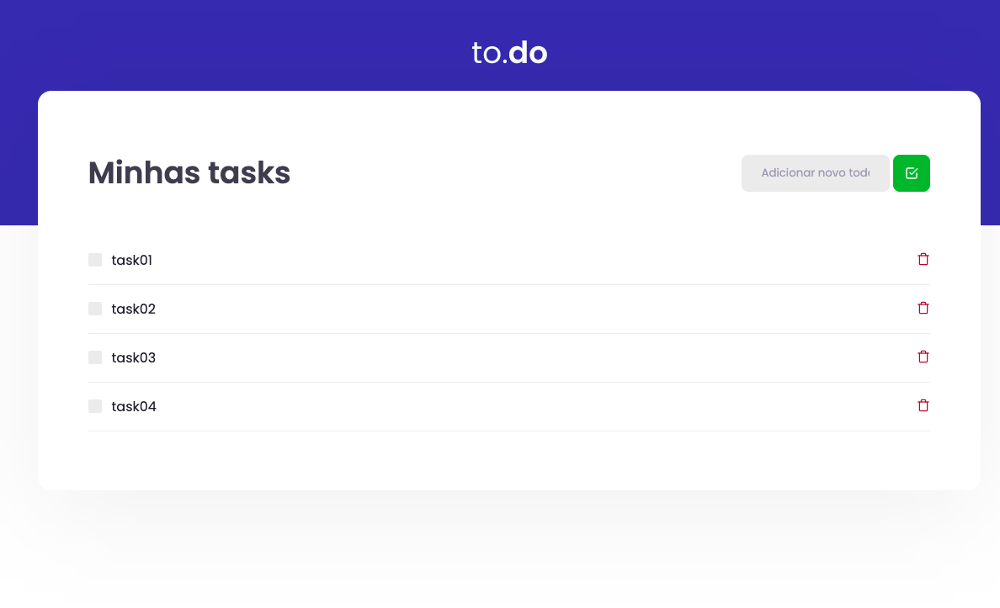

<h1 align="center">
  Ignite - Trilha ReactJS - Desafios
</h2>

Repositório para armazenar os desafios desenvolvidos e resolvidos no Ignite - Trilha ReactJS.

## Índice dos Desafios

- [Desafio 01 - Conceitos do ReactJS](https://github.com/BManduca/desafio01_conceitos_reactjs)

### Anotações
Todas as anotações efetuadas durante o curso sendo realizadas no [Notion](https://www.notion.so/4f961124e62640bb8a3cf5e6d57e70de?v=90b5a123a1af49f593ddf7b042f5e209)